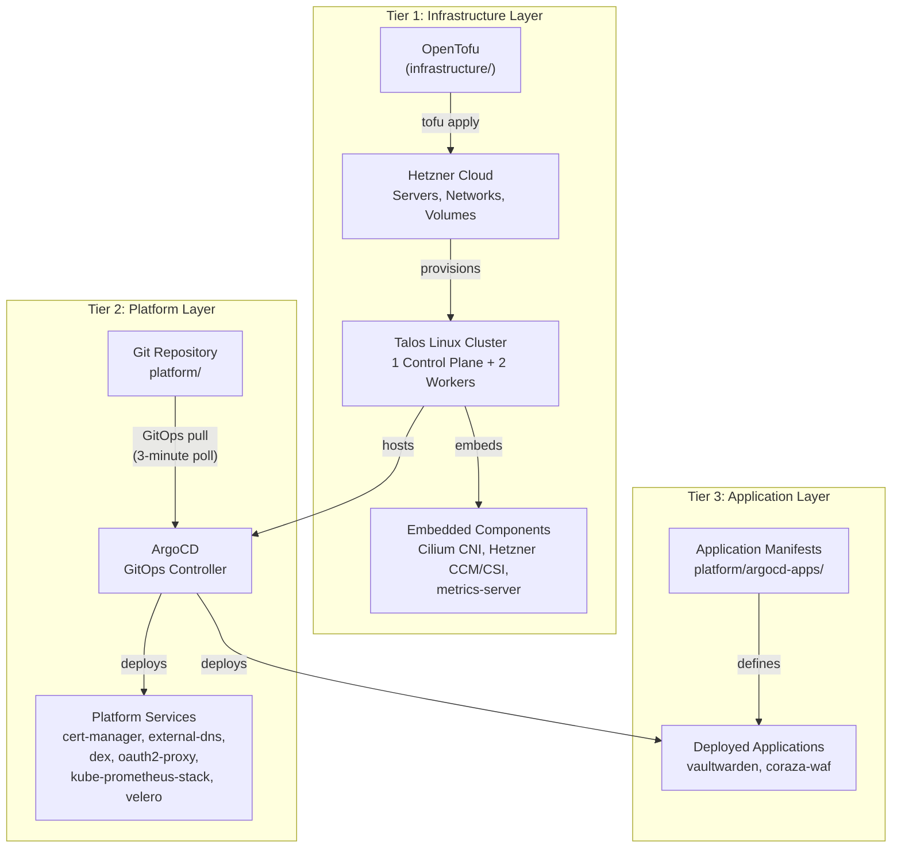

# Platform Zero

A production-grade Kubernetes cluster on Hetzner Cloud, fully defined as code. Built with Talos Linux, Cilium, ArgoCD, and SOPS — no SSH, no manual kubectl, no plaintext secrets.



## Architecture & Core Components

### Infrastructure (OpenTofu + Talos Linux)

The underlying infrastructure is provisioned on Hetzner Cloud using OpenTofu. Talos Linux is the operating system — immutable, API-managed, no SSH.

- **Node Topology**: 1 Control Plane, 2 Worker nodes (CPX22: 2 vCPU, 4GB RAM each).
- **Storage**: Hetzner CSI with LUKS-encrypted volumes (`vault-storage`, `hcloud-volumes-encrypted`).
- **State Management**: OpenTofu state stored in remote S3 backend on Hetzner Object Storage.
- **Custom Images**: Talos Linux snapshots built via Packer for amd64 and arm64 architectures.

### Networking (Cilium + Gateway API)

- **Cilium CNI**: eBPF-based networking with full kube-proxy replacement.
- **Gateway API**: Layer 7 traffic routing and TLS termination via HTTPRoutes.
- **Pod-to-Pod Encryption**: Transparent WireGuard encryption for all intra-cluster traffic.
- **ExternalDNS**: Automated DNS record creation on Cloudflare from Gateway API resources.
- **cert-manager**: Automated Let's Encrypt TLS certificate provisioning with Gateway API integration.

### GitOps & Delivery (ArgoCD + KSOPS)

Platform delivery uses a pull-based GitOps model. ArgoCD runs in-cluster and continuously reconciles the desired state from this repository.

- **ArgoCD**: 9 active Application resources manage all platform components with automated sync, self-heal, and pruning. Uses an App-of-Apps pattern — `platform-manifests` manages all other Application manifests via kustomize.
- **KSOPS**: Kustomize exec plugin for decrypting SOPS+age encrypted secrets at sync time — secrets are encrypted at rest in git.
- **Helmfile**: Defines Helm release values (used by CI for linting/validation; ArgoCD Applications mirror the values for deployment).
- **ArgoCD UI**: Exposed at `argocd.cereghino.me` with Dex SSO (GitHub OIDC).

### Security & Access

- **Dex & OAuth2-Proxy**: Identity-Aware Proxying via GitHub OIDC. Services like Hubble UI and ArgoCD are behind this authentication layer.
- **SOPS + age**: All Kubernetes secrets are encrypted in git and only decrypted in-cluster by KSOPS.
- **Coraza WAF**: Web Application Firewall (Caddy + Coraza with OWASP CRS) protecting Vaultwarden and Grafana. Deprecated (see [ADR-022](docs/adrs/022-waf-coraza.md)).
- **OIDC kubeconfig**: kubectl access secured via Dex → GitHub OIDC, no static tokens.
- **RBAC**: ClusterRoleBinding maps OIDC email claim to cluster-admin.

### Observability & Backups

- **Monitoring**: `kube-prometheus-stack` (Prometheus + Grafana).
- **Network Visibility**: Cilium Hubble with UI behind OAuth2-Proxy.
- **Etcd Backups**: Automated hourly backups to Hetzner S3, encrypted with age.
- **Workload Backups**: Velero for Kubernetes manifest and persistent volume backups.

### Platform Services

- **Vaultwarden**: Self-hosted password manager backed by CloudNativePG PostgreSQL (3 replicas).

## CI/CD

| Pipeline | Trigger | Steps |
|----------|---------|-------|
| **CI** (PR + push) | `infrastructure/**` | `tofu fmt -check` → `tofu validate` → `tofu plan` |
| **CI** (PR + push) | `platform/**` | `yamllint` → `helmfile lint` → `kubeconform` |
| **Infra CD** (push to master) | `infrastructure/**` | `tofu apply -auto-approve` |
| **Platform CD** | push to master | ArgoCD auto-sync (self-heal + prune) |

## Repository Structure

```
infrastructure/          OpenTofu configs for Hetzner Cloud + Talos bootstrap
infrastructure/packer/   Packer image definitions (Talos Linux, amd64/arm64)
infrastructure/templates Talos shell script templates
platform/                Helmfile, kustomize, raw K8s manifests
platform/argocd-apps/    ArgoCD Application manifests (13 total, 9 active)
platform/waf-chart/      Custom Helm chart for Coraza WAF (deprecated)
scripts/                 Utility scripts (upstream-sync, env loader)
secrets/                 SOPS-encrypted local development secrets
.github/workflows/       CI (lint, plan, validate) and Infra CD
docs/adrs/               Architecture Decision Records (32 ADRs)
docs/runbooks/           Operational runbooks
docs/post-mortems/       Incident post-mortems
docs/architecture.md     Full architecture diagrams (Mermaid)
```

## Getting Started

### 1. Infrastructure

```bash
source scripts/env.sh                              # Load SOPS-encrypted secrets
cd infrastructure && tofu init && tofu apply        # Provision cluster
```

This provisions servers, networks, and bootstraps Talos Kubernetes. The `sops-age-key` Secret is created in the `argocd` namespace via a Talos inline manifest.

### 2. Platform (bootstrap ArgoCD, then it takes over)

```bash
cd platform
helmfile apply --selector name=argocd               # Install ArgoCD
kubectl apply -f argocd-apps/platform-manifests.yaml # Bootstrap App-of-Apps
```

`platform-manifests` then reconciles all other ArgoCD Applications from git automatically. Subsequent changes are deployed by pushing to `master`.

## Exposed Services

| Service | Domain | Protection |
|---------|--------|------------|
| ArgoCD | argocd.cereghino.me | Dex SSO (GitHub OIDC) |
| Dex | dex.cereghino.me | Direct (OIDC issuer) |
| Hubble UI | hubble.cereghino.me | OAuth2-Proxy (GitHub OIDC) |
| Vaultwarden | vault.cereghino.me | Coraza WAF |
| Grafana | grafana.cereghino.me | Coraza WAF |

## Documentation

- **[Architecture Diagrams](docs/architecture.md)** — Full Mermaid diagrams: three-tier architecture, GitOps flow, CI/CD sequences, dependency map, directory layout.
- **[Architecture Decision Records](docs/adrs/)** — 32 ADRs covering every major design decision from cloud provider selection to VPN access strategy.
- **[Operational Runbooks](docs/runbooks/)** — Cluster access, infrastructure deployment, ArgoCD operations, platform changes, secrets management.
- **[Post-Mortems](docs/post-mortems/)** — Incident documentation with root cause analysis and action items.
