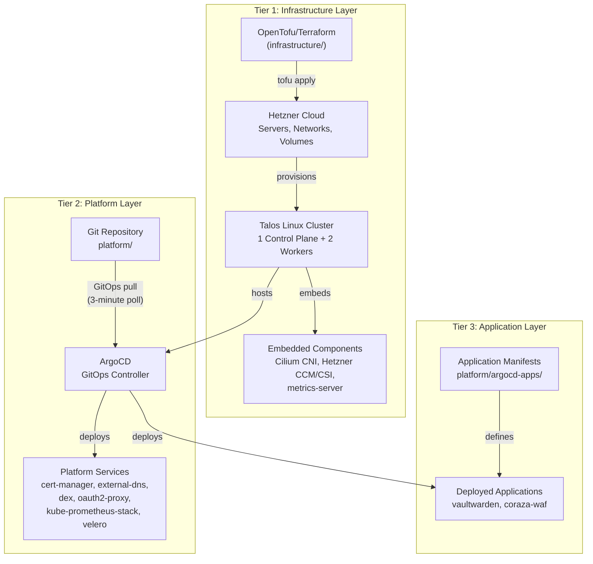
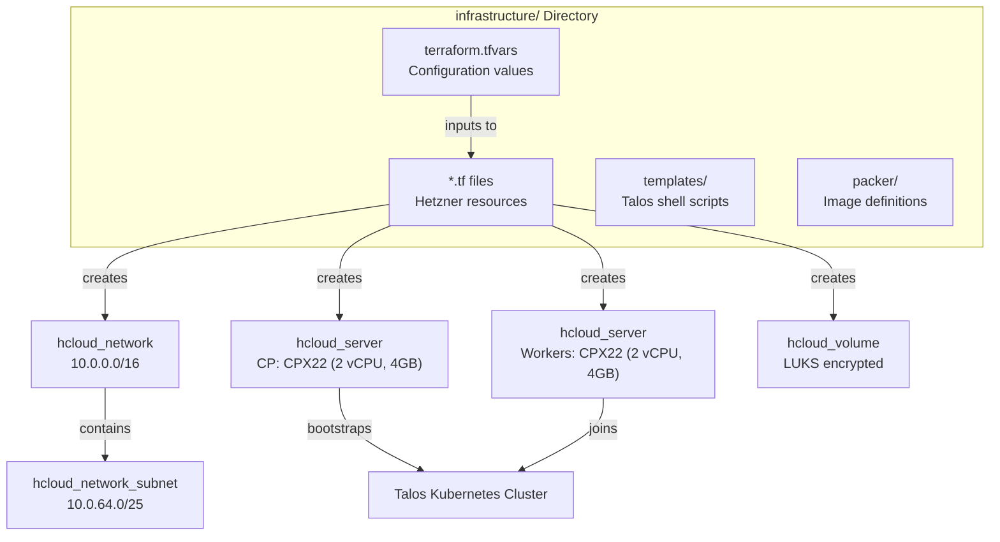
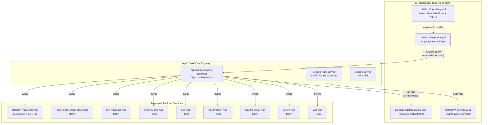
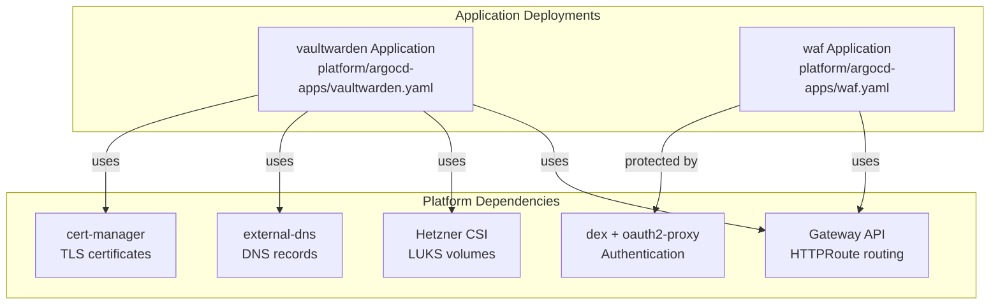
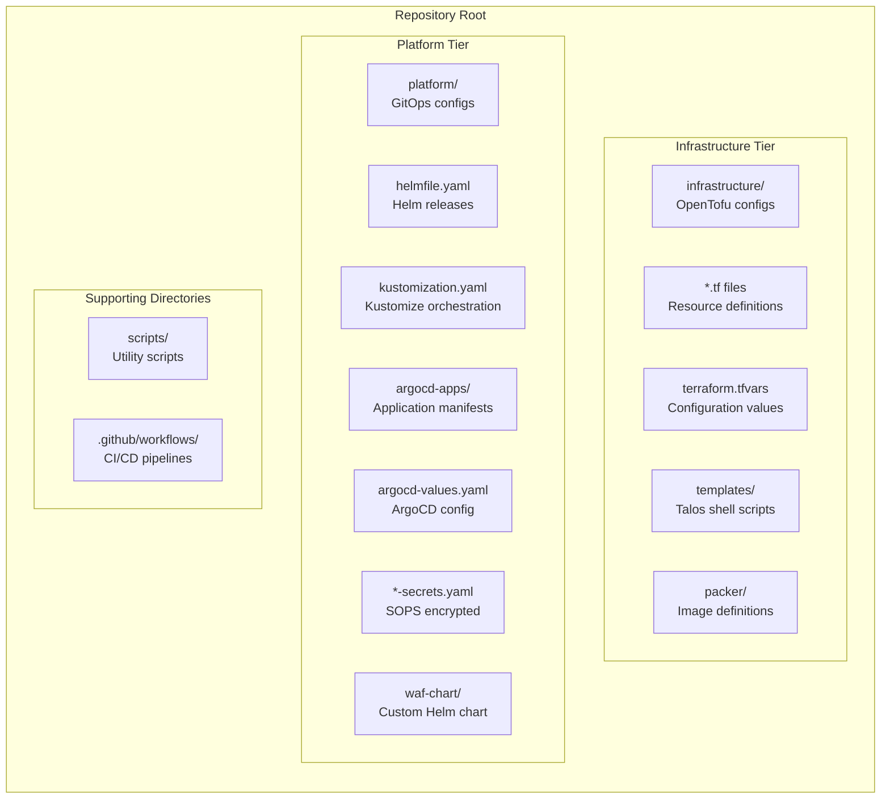

# Platform Zero — Architecture

## Three-Tier Architecture

The system implements a three-tier architecture that separates infrastructure provisioning, platform services, and end-user applications into distinct layers with different deployment models and lifecycles.

## Infrastructure Components

## GitOps with ArgoCD

## Application Dependencies

## Infrastructure CI/CD Flow

```mermaid
sequenceDiagram
    participant DEV as Developer
    participant GH as GitHub Actions (CI/CD)
    participant TF as OpenTofu CLI
    participant HZ as Hetzner Cloud API
    participant TALOS as Talos Linux
    participant K8S as Kubernetes API

    rect rgb(40, 40, 60)
    note over DEV, K8S: Pull Request (Validation Only)
    DEV->>GH: Push to PR branch (infrastructure/**)
    GH->>TF: tofu fmt -check
    GH->>TF: tofu init
    GH->>TF: tofu validate
    GH->>TF: tofu plan
    GH->>DEV: Post plan to PR comment
    end

    rect rgb(40, 60, 40)
    note over DEV, K8S: Merge to Master (Auto-Deploy)
    DEV->>GH: Merge PR to master
    GH->>TF: tofu apply -auto-approve
    TF->>HZ: Create/update servers, networks
    TF->>TALOS: Generate machine configs
    TALOS->>K8S: Bootstrap cluster
    K8S-->>TF: Cluster operational
    TF->>K8S: Create sops-age-key Secret (Talos inline manifest)
    end
```

## Platform CI/CD Flow

```mermaid
sequenceDiagram
    participant DEV as Developer
    participant CI as GitHub Actions (Platform CI)
    participant GIT as Git Repository (master branch)
    participant ARGO as ArgoCD Controller
    participant KSOPS as KSOPS Plugin
    participant K8S as Kubernetes API

    rect rgb(40, 40, 60)
    note over DEV, K8S: Pull Request (Validation Only)
    DEV->>CI: Push to PR branch (platform/**)
    CI->>CI: yamllint platform/
    CI->>CI: helmfile lint
    CI->>CI: helmfile template | kubeconform
    end

    rect rgb(40, 60, 40)
    note over DEV, K8S: Merge to Master (GitOps Sync)
    DEV->>GIT: Merge PR to master
    ARGO->>GIT: Poll every 3 minutes
    ARGO->>ARGO: Detect changes
    ARGO->>KSOPS: Decrypt *-secrets.yaml
    KSOPS->>K8S: Use sops-age-key Secret
    ARGO->>K8S: Apply manifests (sync + self-heal + prune)
    end
```

## Directory Structure

